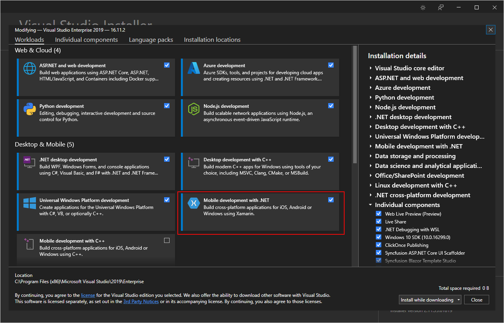

# CS108-Mobile-CSharp-DotNetStd-App-v4

CS108 Xamarin C# Bluetooth Demo App and SDK 

- .NET Standard 2.0 and MvvmCross 7
- Support implementations on iOS and Android platform

This application provides demonstrations to the programming interface made available on the CS108 handheld reader for configuring, controlling, and accessing the RFID reader.  The development was based on the unified CS108 C# Callback-based API that made available on different CSL readers.  This API is applicable to both iPhone iOS and Android environment.  

[Product Information](https://www.convergence.com.hk/cs108/)
 

## Pre-requisite

The build environment consists of tools and the corresponding configurations of the Visual Studio 2019(Windows) or Xamarin (Mac).  It is expected that the system integrator or the software system programming house will be developing the applications on Visual Studio 2019 (Windows) or Xamarin (Mac).  With this tool, typically he has to write programs on the PC/Mac.  The following are needed to set up the build environment.

## System Diagram

## Basic configuration on PC

Operating System requirement:
-	Microsoft Windows 10 (English)

Software package required:
-	Microsoft Visual Studio 2019

To build demo application successfully, you need to install Microsoft Visual Studio 2019 or above. For more detailed information, please go to [Microsoft webpage](https:/docs.microsoft.com/en-us/visualstudio/welcome-to-visual-studio).
  
[Visual Studio 2019](https://www.visualstudio.com/zh-hant/vs/whatsnew/)

In Visual Studio, you need to use the Visual Studio Installer to add the Xamarin package: 

   

## Basic Configuration on Mac

Operating System requirement:
-	Mac OS 10 (English)

Software package required:
-	Microsoft Visual Studio 2019 for MAC
-	Xcode 9

To build demo application successfully, you need to install Visual Studio 2019 or above. For more detailed information, please go to [Xamarin webpage](https://www.xamarin.com/).
  
[Xamarin]https://www.xamarin.com/platform
  

## Callback-based API Library

The CS108 Callback-based API Library consists of the following files. 

|File   | Location of source code |Remarks  |
|-------|-------------------------|---------|
|CSLibrary.dll|Inside folder “/CSLibrary/bin/Debug” of the CS108 Demo Code|CSL C# Callback-based API Class Library. Different library files.|
 

## CS108 C# API: Theory of Operation

The CS108 C# Application Programming Interface (API) provides a programming interface for controlling CS108 integrated reader. The interface is loaded by a mobile application; the application in turn explicitly initializes the interface. The interface supports enumeration of attached RFID radio modules, returning unique identification information for each currently-attached RFID radio modules. An mobile application uses the CS108 C# API to establish a connection and grant the application exclusive control of the corresponding RFID radio module. After an application is granted exclusive control of an RFID radio module, the application can configure the RFID radio module for operation and tag protocol operations can be issued. The CS108 C# API allows an application control of low level functions of the Firmware, including but not limited to: 

- regulatory configuration of frequencies 
- antenna output power 
- air protocol parameters, such as Q value 

Some of these configuration parameters are abstracted by the CS108 C# API. The application initiates transactions with ISO 18000-6C tags or tag populations by executing ISO 18000-6C tag-protocol operations. The interface exposes direct access to the following ISO 18000-6C tag-protocol operations: 

- Inventory 
- Read 
- Write 
- Kill 
- Erase 
- Lock 

When executing tag-protocol operations, the interface provides the application with the ability to configure tag-selection (i.e., ISO 18000-6C Select) criteria and query (i.e. ISO 18000-6C Query) parameters. The interface extends the ISO 18000-6C tag- protocol operations by additionally providing the application the ability to specify a post-singulation Electronic Product Code (EPC) match mask as well as the number of tags to which the operation is to be applied. Additionally, the interface supports configuration of dense-reader mode during ISO 18000-6C tag-protocol operations. The interface supports the configuration and control of the antenna. The application is given fine-grained control to configure: 

- A time limit for performing tag-protocol operations (dwell time) 
- The number of times a tag-protocol operation is executed (number of inventory rounds) 
- RF characteristics (for example, RF power). 

The interface supports a callback model for presenting tag-protocol operation response data to the application. When an application issues a tag-protocol request (i.e. inventory, read, etc.), it also provides a pointer to a callback function API invokes. To help simplify the packet-processing code the API provides complete tag-protocol operation response packets. Tag-protocol operation results include EPC values returned by the Inventory operation, read data returned by the Read operation, and operation status returned by the Write, Kill, Erase, and Lock operations. The application can request the returned data be presented in one of three formats: compact, normal, or extended. Compact mode contains the minimum amount of data necessary to return the results of tag-protocol operations to the application. Normal mode augments compact mode by interleaving additional status/contextual information in the operation results, so that the application can detect, for example, the start of inventory rounds, when a new antenna is being used, etc. Extended mode augments normal mode by interleaving additional diagnostic and statistical data with the operation results. The interface supports diagnostic and statistical reporting for radio, inventory, singulation, tag access, and tag performance as well as status packets to alert the application to unexpected errors during tag- protocol operations. 

The interface provides the application with access to (i.e., read and write) the configuration data area on the RFID radio module. The application can use the configuration data area to store and retrieve the specific hardware configuration and capabilities of the radio. The application can read a RFID radio module’s configuration data area immediately after gaining exclusive control of the RFID radio module and use that data to configure and control low-level radio parameters. The interface also supports low-level control of the RFID Firmware. 

## Callback-based API Classes, Methods and Events

Please refer to the documentation under the folder CSLibrary/docs

